# 💪 Pulse Fitness

A modern, responsive, and interactive fitness website built using **HTML5, CSS3, and Vanilla JavaScript**.


🔗 **Repository:** [gym-website Repository](https://github.com/ruaaalbataineh-boop/gym-website)


---

## 📌 About The Project

**Pulse Fitness** is a modern fitness website designed to provide users with a smooth and engaging experience while exploring gym services, classes, trainers, membership plans, and weekly schedules.

The website features a clean and responsive design that works across different screen sizes and devices.

---

## ✨ Features

* 🏠 Modern Home section with a hero banner
* ⭐ Features section highlighting gym benefits
* ℹ️ About section
* 🏋️ Fitness Classes section
* 👥 Trainers section
* 🖼️ Gallery section
* 💬 Testimonials section
* 💳 Membership plans
* 📅 Weekly Schedule
* 📩 Contact section
* 📱 Fully Responsive Design
* 🎨 Modern and clean user interface
* ⚡ Interactive JavaScript functionality

---

## 🛠️ Built With

* **HTML5**
* **CSS3**
* **Vanilla JavaScript**
* **Font Awesome 6.7.2**

---

## 📂 Project Structure

```text
Pulse-Fitness/
│
├── index.html
│
├── css/
│   └── style.css
│
├── js/
│   └── script.js
│
├── images/
│   ├── hero.png
│   ├── about.png
│   ├── trainer1.jpg
│   ├── trainer2.jpg
│   ├── trainer3.jpg
│   ├── gallery1.jpg
│   ├── gallery2.jpg
│   ├── gallery3.jpg
│   ├── gallery4.jpg
│   ├── gallery5.jpg
│   └── gallery6.jpg
│
├── screenshots/
│   ├── Home.png
│   ├── Features.png
│   ├── About.png
│   ├── Classes.png
│   ├── Trainers.png
│   ├── Gallery.png
│   ├── Testimonials.png
│   ├── Membership.png
│   ├── Schedule.png
│   ├── Contact.png
│   └── Footer.png
│
└── README.md
```

---

## 📸 Screenshots

### 🏠 Home

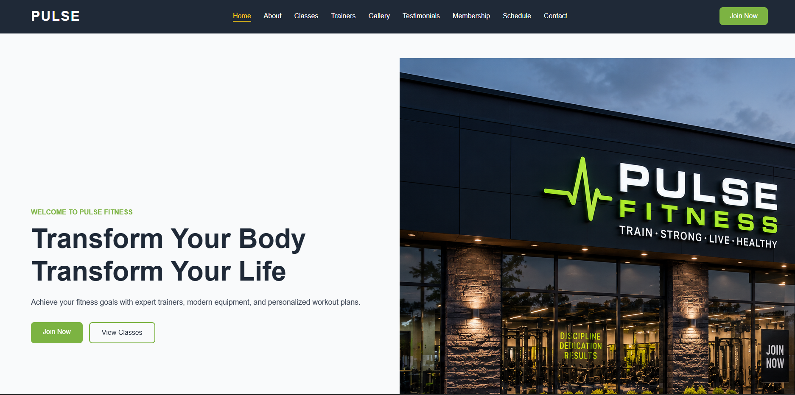

### ✨ Features


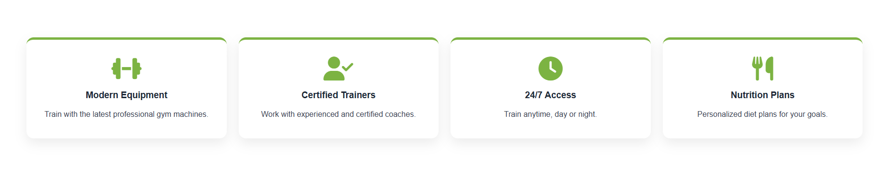


### ℹ️ About

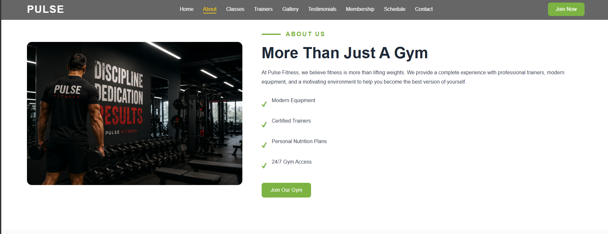


### 🏋️ Classes

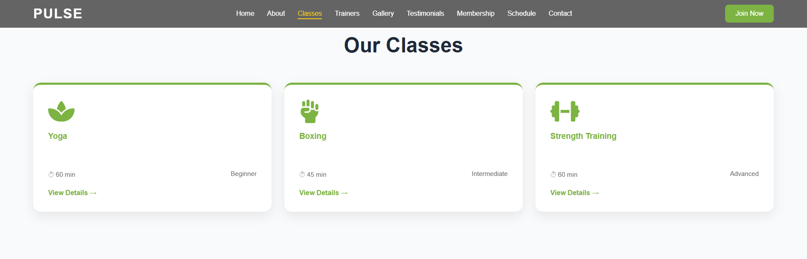


### 👥 Trainers

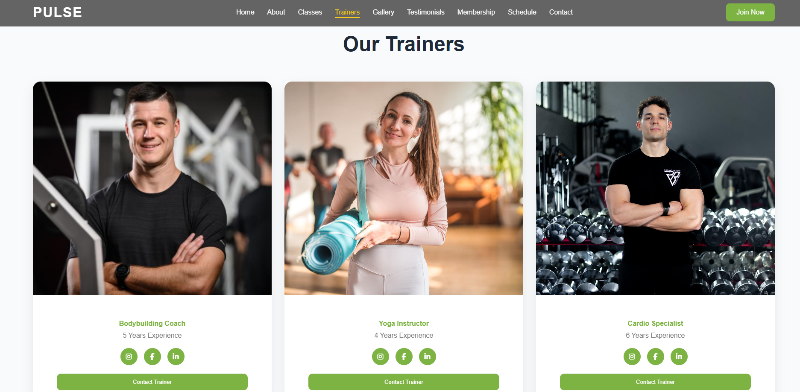


### 🖼️ Gallery

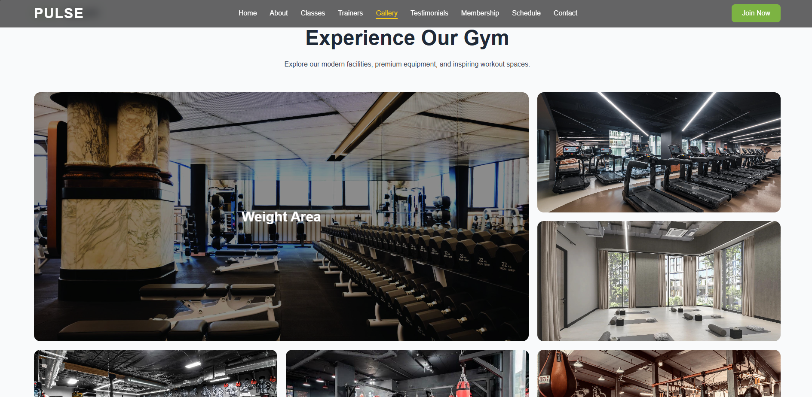


### ⭐ Testimonials

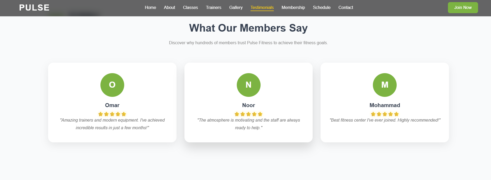


### 💳 Membership

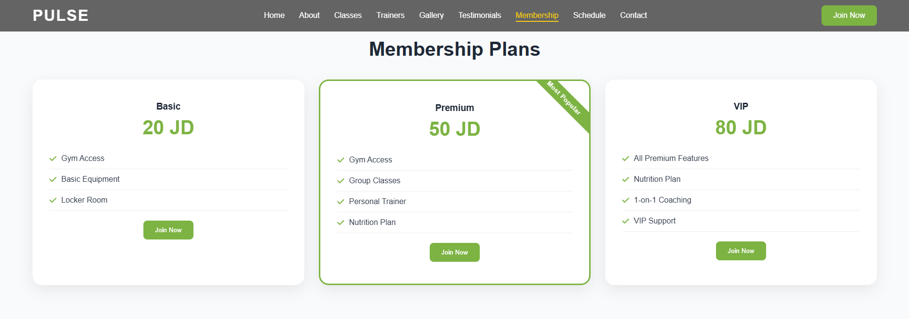


### 📅 Schedule

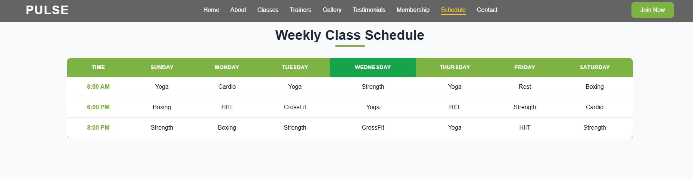


### 📩 Contact

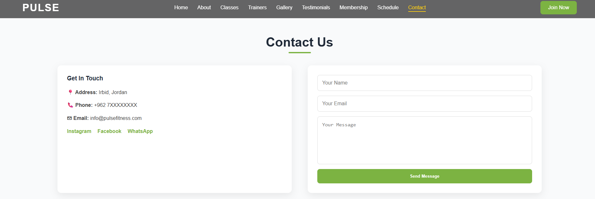


### 🔻 Footer

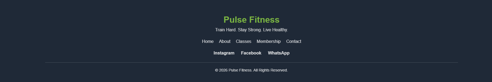

---

## ⚡ JavaScript Functionality

The website uses Vanilla JavaScript to provide interactive functionality such as:

* Navigation interactions
* Smooth scrolling
* Interactive buttons
* Dynamic website behavior
* User interface interactions

---

## 📱 Responsive Design

Pulse Fitness is designed to be responsive and accessible on different screen sizes, including:

* 💻 Desktop
* 💻 Laptop
* 📱 Tablet
* 📱 Mobile

The layout adapts to different screen widths to provide a better user experience.

---

## 🚀 How To Run

1. Clone the repository:

```bash
git clone https://github.com/ruaaalbataineh-boop/Pulse-Fitness.git
```

2. Open the project folder.

3. Open `index.html` in your browser.

4. Enjoy the **Pulse Fitness** website! 💪

---

## 🔮 Future Improvements

* Add a real membership registration system
* Add a backend for the contact form
* Add user authentication
* Add online class booking
* Add payment integration
* Add more interactive animations
* Improve accessibility
* Add a database for trainers, classes, and memberships

---

## 🎯 Learning Objectives

This project helped practice and improve skills in:

* HTML5 semantic structure
* CSS3 styling and responsive layouts
* JavaScript DOM manipulation
* Website navigation
* Responsive web design
* UI/UX principles
* Organizing a complete web project
* Using external icon libraries

---

## 👩‍💻 Author

**Ruaa Al-Bataineh**

🔗 [GitHub](https://github.com/ruaaalbataineh-boop)

---

## ⭐ Support

If you like this project, feel free to **star the repository** on GitHub! ⭐

Thank you for checking out **Pulse Fitness** 💪
